# Moduł client
Moduł client odpowiada za wysyłanie żądań HTTP oraz zrządzanie sesją. W skład modułu wchodzą dwie klasy, **Client** zawiera podstawowe metody pozwalające na wysyłanie żądań, odpowiada również za automatyczne utrzymywanie sesji, natomiast **ApplicationClient** jest klasą pochodną z klasy **Client** opartą o wzorzec singleton, która posiada złożone metody wysyłające żądania do konkretnych endpointów API. Moduł korzysta z modułu entities, który zawiera klasy encji.

## Diagram UML klas

```plantuml
@startuml
class Exception{
}
class Thread{
}
class Client{
    - final HttpClient client;
    - String token;
    - LocalDateTime tokenTime;
    - String baseUrl;
    - String refreshUrl;
	+ void setBaseUrl();
	+ void setRefreshUrl();
	+ HttpRequest.Builder request();
	+ HttpResponse<String> fetch();
	+ void setToken();
	- void refreshToken();
	+ void run();
}
class ClientError as "Client.ClientError"{
    - HttpResponse<String> response;
	+ HttpResponse<String> getResponse();
}
class ApplicationClient{
    + void authenticate();
    + User getUserData();
    + void logOut();
    + ArrayList<User> getAllUsers();
    + void createUser();
    + User getUserCredentials();
    + ArrayList<Subject> getAllSubjects();
    + void createSubject();
    + ArrayList<SchoolGroup> getAllClass();
    + void createClass();
    + ArrayList<Student> getAllStudents();
    + ArrayList<Student> getClassStudents();
    + void addStudent();
    + ArrayList<SchoolClass> getClassSchedule();
    + void addClassSchedule();
    + ArrayList<Lesson> getLessons();
    + void addLesson();
    + ArrayList<Attendance> getAttendanceList();
    + void updateAttendance();
    + ArrayList<Grade> getGradesList();
    + void addGrade();
    + ArrayList<SchoolClass> getUserSchedule();
    + ArrayList<Attendance> getUserAttendance();
    + ArrayList<Grade> getUserGrades();
    + void updateUserPassword();
}

package "entities"{
class User{
    - Integer id;
    - String email;
    - String name;
    - String surname;
    - String password;
    - Role role;
    + Integer getId();
    + void setId();
    + String getEmail();
    + void setEmail();
    + String getSurname();
    + void setSurname();
    + String getName();
    + void setName();
    + String getPassword();
    + void setPassword();
    + Role getRole();
    + void setRole();
}
enum Role as "User.Role"{
    * admin;
    * student;
    * teacher;
    + String toString();
}
class SchoolGroup{
    - Integer id;
    - Integer number;
    - Character letter;
    - ArrayList<Student> students;
    + Integer getId();
    + void setId();
    + Integer getNumber();
    + void setNumber();
    + Character getLetter();
    + void setLetter();
    + ArrayList<Student> getStudents();
    + void addStudent();
}
class Student{
    - SchoolGroup schoolGroup;
    + SchoolGroup getSchoolGroup();
    + void setSchoolGroup();
}
class Subject{
    - Integer id;
    - String name;
    + Integer getId();
    + void setId();
    + String getName();
    + void setName();
}
class Teacher{}
class Lesson{
    - Integer id;
    - String topic;
    - String date;
    - SchoolClass schoolClass;
    + Integer getId();
    + void setId();
    + String getTopic();
    + void setTopic();
    + String getDate();
    + void setDate();
    + SchoolClass getSchoolClass();
    + void setSchoolClass();
}
class SchoolClass{
    - Integer id;
    - String day;
    - String startTime;
    - String endTime;
    - SchoolGroup schoolGroup;
    - Teacher teacher;
    - Subject subject;
    - Integer room;
    + Integer getRoom();
    + void setRoom();
    + SchoolGroup getSchoolGroup();
    + void setSchoolGroup();
    + Teacher getTeacher();
    + void setTeacher();
    + Subject getSubject();
    + void setSubject();
    + Integer getId();
    + void setId();
    + String getDay();
    + void setDay();
    + String getStartTime();
    + void setStartTime();
    + String getEndTime();
    + void setEndTime();
}
class Attendance{
    - Student student;
    - Lesson lesson;
    - Status status;
    + Student getStudent();
    + void setStudent();
    + Lesson getLesson();
    + void setLesson();
    + Status getStatus();
    + void setStatus();
}
enum Status as "Attendance.Status"{
    * present;
    * absent;
    * late;
    * undefined;
    + String toString();
}
class Grade{
    - Integer id;
    - Student student;
    - Subject subject;
    - Teacher teacher;
    - GradeName grade;
    - String title;
    - String comment;
    + String getTitle();
    + void setTitle();
    + String getComment();
    + void setComment();
    + Integer getId();
    + void setId();
    + Student getStudent();
    + void setStudent();
    + Subject getSubject();
    + void setSubject();
    + GradeName getGrade();
    + void setGrade();
    + Teacher getTeacher();
    + void setTeacher();
}
enum GradeName as "Grade.GradeName"{
    * 1;
    * 2;
    * 3;
    * 4;
    * 5;
    * 6;
    * np;
    * nb;
    + String toString();
}
class Message{
    - HashMap<String, String> messages;
    + void addMessage();
    + HashMap<String, String> getMessages();
}
class UserChangePassword{
    + String newPassword;
    + String newPasswordConfirm;
}
class UserCredentials{
    - String email;
    - String password;
    + String getEmail();
    + void setEmail();
    + String getPassword();
    + void setPassword();
}
}

ClientError--|>Exception
Client--|>Thread
ApplicationClient--*Client
Client..>ClientError

ApplicationClient--|>Database
ApplicationClient-->entities.User
ApplicationClient-->entities.Subject
ApplicationClient-->entities.SchoolGroup
ApplicationClient-->entities.Student
ApplicationClient-->entities.SchoolClass
ApplicationClient-->entities.Attendance
ApplicationClient-->entities.Lesson
ApplicationClient-->entities.Teacher
ApplicationClient-->entities.Grade
ApplicationClient-->entities.Message
ApplicationClient-->entities.UserChangePassword
ApplicationClient-->entities.UserCredentials
@enduml
```
