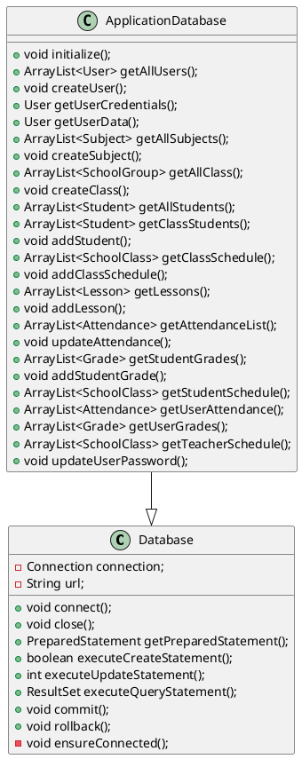

# Baza danych e-dziennika

Aplikacja korzysta z wbudowanej bazy danych SQLite. Posiada moduł z dwiema klasami odpowiedzialnym za zapisywanie i pobieranie danych z bazy danych.

## Tabele w bazie danych

1. Użytkownicy(users)
   Tabela przechowująca konta użytkowników aplikacji.

| Nazwa kolumny | Typ          | Dodatkowe opcje kolumny | Opis                                              |
|---------------|--------------|-------------------------|---------------------------------------------------|
| uid           | INTEGER      | PRIMARY KEY             | Unikatowy identyfikator przypisany do użytkownika |
| email         | VARCHAR(100) | UNIQUE NOT NULL         | Unikalny adres e-mail użytkownika                 |
| uname         | VARCHAR(50)  | NOT NULL                | Imie użytkownika                                  |
| surname       | VARCHAR(50)  | NOT NULL                | Nazwisko użytkownika                              |
| password      | TEXT         | NOT NULL                | Hasło do konta użytkownika                        |
| role          | VARCHAR(20)  | DEFAULT NULL            | Rola użytkownika (np. admin, student)             |

2. Klasy(classes)
   Tabela przechowująca listę klas.

| Nazwa kolumny | Typ     | Dodatkowe opcje kolumny | Opis                                        |
|---------------|---------|-------------------------|---------------------------------------------|
| cid           | INTEGER | PRIMARY KEY             | Unikatowy identyfikator przypisany do klasy |
| number        | INTEGER | NOT NULL                | Numer klasy (np. 1, 2, 7)                   |
| letter        | CHAR(1) | NOT NULL                | Litera klasy (np. A, B, D)                  |

3. Uczniowie(students)
   Tabela przechowująca informacje o przypisaniu uczniów do klas.

| Nazwa kolumny | Typ     | Dodatkowe opcje kolumny | Opis                      |
|---------------|---------|-------------------------|---------------------------|
| uid           | INTEGER | FOREIGN KEY, UNIQUE     | Identyfikator użytkownika |
| cid           | INTEGER | FOREIGN KEY             | Identyfikator klasy       |

4. Przedmioty(subjects)
   Tabela przechowująca listę przedmiotów.

| Nazwa kolumny | Typ     | Dodatkowe opcje kolumny | Opis                                                       |
|---------------|---------|-------------------------|------------------------------------------------------------|
| sbid          | INTEGER | PRIMARY KEY             | Unikatowy identyfikator przypisany do przedmiotu szkolnego |
| sbname        | TEXT    | UNIQUE NOT NULL         | Nazwa przedmiotu szkolnego                                 |

5. Plan zajęć(time_table)
   Tabela przechowująca tygodniowy plan zajęć.

| Nazwa kolumny | Typ     | Dodatkowe opcje kolumny | Opis                                                     |
|---------------|---------|-------------------------|----------------------------------------------------------|
| ttid          | INTEGER | PRIMARY KEY             | Unikatowy identyfikator zajęć lekcyjnych w plane lekcji  |
| day           | TEXT    | NOT NULL                | Dzień w którym odbywają się zajęcia (np. Monday, Friday) |
| startTime     | TEXT    | NOT NULL                | Godzina rozpoczęcia zajęć, zapisana w formacie HH:MM:SS  |
| endTime       | TEXT    | NOT NULL                | Godzina zakończenia zajęć, zapisana w formacie HH:MM:SS  |
| cid           | INTEGER | FOREIGN KEY             | Identyfikator klasy, której dotyczy lekcja               |
| tid           | INTEGER | FOREIGN KEY             | Identyfikator nauczyciela, który prowadzi lekcję         |
| sbid          | INTEGER | FOREIGN KEY             | Identyfikator przedmiotu                                 |
| room          | INTEGER |                         | Numer sali liekcyjnej                                    |

6. Lekcje(lessons)
   Tabela przechowująca lekcję, które się odbyły.

| Nazwa kolumny | Typ     | Dodatkowe opcje kolumny | Opis                                                   |
|---------------|---------|-------------------------|--------------------------------------------------------|
| lid           | INTEGER | , PRIMARY KEY           | Unikatowy identyfikator lekcji                         |
| topic         | TEXT    | NOT NULL                | Temat Zajęć lekcyjnych                                 |
| date          | TEXT    | NOT NULL                | Data, kiedy odbywały się zajęcia w formacie DD.MM.YYYY |
| ttid          | INTEGER | FOREIGN KEY             | Identyfikator zajęć z planu zajęć                      |

7. Frekwencja(attendance)
   Tabela przechowująca frekwencję uczniów na zajęciach.

| Nazwa kolumny | Typ     | Dodatkowe opcje kolumny | Opis                                  |
|---------------|---------|-------------------------|---------------------------------------|
| sid           | INTEGER | FOREIGN KEY             | Identyfikator ucznia                  |
| lid           | INTEGER | FOREIGN KEY             | Identyfikator lekcji                  |
| status        | TEXT    | NOT NULL                | Status frekwencji (np. present, late) |

8. Oceny(grades)
   Tabela przechowująca oceny uczniów.

| Nazwa kolumny | Typ         | Dodatkowe opcje kolumny | Opis                                            |
|---------------|-------------|-------------------------|-------------------------------------------------|
| gid           | INTEGER     | PRIMARY KEY             | Unikatowy identyfikator oceny                   |
| sid           | INTEGER     | FOREIGN KEY             | Identyfikator ucznia, który otrzymał ocenę      |
| sbid          | INTEGER     | FOREIGN KEY             | Identyfikator przedmiotu                        |
| tid           | INTEGER     | FOREIGN KEY             | Identyfikator nauczyciela, który wystawił ocenę |
| grade         | VARCHAR(10) | NOT NULL                | Ocena                                           |
| title         | TEXT        | NOT NULL                | Tytuł oceny                                     |
| comment       | TEXT        | DEFAULT NULL            | Komentarz do oceny                              |

## Używane kwerendy

### Tworzenie tabel

* tworzy tabelę `users`
```sql
CREATE TABLE IF NOT EXISTS users (uid INTEGER PRIMARY KEY, email VARCHAR(100) UNIQUE NOT NULL, uname VARCHAR(50) NOT NULL, surname VARCHAR(50) NOT NULL, password TEXT NOT NULL, role VARCHAR(20) DEFAULT NULL);
```
* tworzy tabelę `classes`
```sql
CREATE TABLE IF NOT EXISTS classes (cid INTEGER PRIMARY KEY, number INTEGER NOT NULL, letter CHAR(1) NOT NULL);
```
* tworzy tabelę `students`
```sql
CREATE TABLE IF NOT EXISTS students (uid INTEGER UNIQUE, cid INTEGER, FOREIGN KEY(uid) REFERENCES users(uid), FOREIGN KEY(cid) REFERENCES classes(cid));
```
* tworzy tabelę `subjects`
```sql
CREATE TABLE IF NOT EXISTS subjects (sbid INTEGER PRIMARY KEY, sbname TEXT UNIQUE NOT NULL);
```
* tworzy tabelę `time_table`
```sql
CREATE TABLE IF NOT EXISTS time_table (ttid INTEGER PRIMARY KEY, day TEXT NOT NULL, startTime TEXT NOT NULL, endTime TEXT NOT NULL, cid INTEGER, tid INTEGER, sbid INTEGER, room INT, FOREIGN KEY(cid) REFERENCES users(uid), FOREIGN KEY(sbid) REFERENCES subjects(sbid));
```
* tworzy tabelę `lessons`
```sql
CREATE TABLE IF NOT EXISTS lessons (lid INTEGER PRIMARY KEY, topic TEXT NOT NULL, date TEXT NOT NULL, ttid INTEGER, FOREIGN KEY(ttid) REFERENCES time_table(ttid));
```
* tworzy tabelę `attendance`
```sql
CREATE TABLE IF NOT EXISTS attendance (sid INTEGER, lid INTEGER, status TEXT NOT NULL, FOREIGN KEY(sid) REFERENCES students(sid), FOREIGN KEY(lid) REFERENCES lessons(lid));
```
* tworzy tabelę `grades`
```sql
CREATE TABLE IF NOT EXISTS grades (gid INTEGER PRIMARY KEY, sid INTEGER, sbid INTEGER, tid INTEGER, grade VARCHAR(10) NOT NULL, title TEXT NOT NULL, comment TEXT DEFAULT NULL, FOREIGN KEY(sid) REFERENCES users(uid), FOREIGN KEY(sbid) REFERENCES subjects(sbid), FOREIGN KEY(tid) REFERENCES users(uid));
```

### Wstawianie danych do tabeli

* wstawia nowego użytkownika do tabeli `users`
```sql
INSERT INTO users (email, uname, surname, password, role) VALUES (:email, :uname, :surname, :password, :role);
```
* dodaje nową klasę w tabeli `classes`
```sql
INSERT INTO classes (number, letter) VALUES (:number, :letter); 
```
* przypisuje ucznia do klasy
```sql
INSERT INTO students (uid, cid) VALUES(:uid, :cid); 
```
* dodaje nowy przedmiot
```sql
INSERT INTO subjects (sbname) VALUES (:sbname);
```
* wstawia nowe zajęcia do tabeli `time_table`
```sql
INSERT INTO time_table (day, startTime, endTime, cid, tid, sid, room) VALUES (:day, :startTime, :endTime, :cid, :tid, :sid, :room);
```
* wstawia nową lekcję do tabeli `lessons`
```sql
INSERT INTO lessons (topic, date, ttid) VALUES (:topic, :date, :ttid); - 
```
* dodaje nowy status frekwencji ucznia na zajęciach
```sql
INSERT INTO attendance (sid, lid, status) VALUES (:sid, :lid, :status); 
```
* dodaje nową ocenę ucznia do tabeli `grades`
```sql
INSERT INTO grades (sbid, tid, grade, title, comment) VALUES (:sbid, :tid, :grade, :title, :comment);
```

### Pobieranie danych z tabel

* zwraca listę wszystkich użytkowników
```sql
SELECT uid, email, uname, surname, role FROM users;
```
* zwraca dane potrzebne do uwierzytelnienia i utworzenia sesji
```sql
SELECT uid, email, password, role FROM users WHERE email=:email;
```
* pobiera wszystkie klasy
```sql
SELECT cid, number, letter FROM classes;
```
* pobiera wszystkie przedmioty
```sql
SELECT sbid, sbname FROM subjects;
```
* pobiera wszystkich uczniów razem z informację do której klasy należą
```sql
SELECT U.uname, U.surname, C.number, C.letter FROM users AS U INNER JOIN students AS S ON S.uid=U.uid INNER JOIN classes AS C ON C.cid=S.cid;
```
* pobiera wszystkich uczniów przypisanych do wybranej klasy
```sql
SELECT U.uid, U.uname, U.surname, U.email, C.number, C.letter FROM users AS U INNER JOIN students AS S ON S.uid=U.uid INNER JOIN classes AS C ON C.cid=S.cid WHERE S.cid=:cid;
```
* pobiera tygodniowy plan zajęć dla wybranej klasy
```sql
SELECT TT.day, TT.startTime, TT.endTime, TT.room, T.uname AS tname, T.surname AS tsurname, SB.sbname FROM time_table AS TT INNER JOIN users AS T ON T.uid=TT.tid INNER JOIN subjects AS SB ON SB.sbid=TT.sbid WHERE TT.cid=:cid;
```
* pobiera dane wybranego użytkownika
```sql
SELECT uid, email, uname, surname, role FROM users WHERE uid=:uid;
```
* pobiera lekcje nauczyciela
```sql
SELECT L.lid, L.topic, L.date, SB.sbname FROM lessons AS L INNER JOIN time_table AS TT ON L.ttid=TT.ttid INNER JOIN subjects AS SB ON SB.sbid=TT.sbid WHERE TT.tid=:tid;
```
* pobiera listę obecności na lekcji
```sql
SELECT A.status, U.uid, U.uname, U.surname, L.topic, L.date FROM attendance AS A INNER JOIN users AS U ON A.sid=U.uid INNER JOIN lessons AS L ON L.lid=A.lid WHERE L.lid=:lid;
```
* pobiera oceny ucznia wystawione przez wybranego nauczyciela
```
sqlSELECT G.grade, G.title, G.comment, SB.sbname, U.uname, U.surname FROM grades AS G INNER JOIN subjects AS SB ON G.sbid=SB.sbid INNER JOIN users AS U ON G.sid=U.uid WHERE G.tid=:tid AND G.sid=:sid;
```
* pobieranie planu zajęć wybranego ucznia
```sql
SELECT TT.ttid, TT.day, TT.startTime, TT.endTime, TT.room, SB.sbname, T.uname AS tname, T.surname AS tsurname FROM time_table AS TT INNER JOIN classes AS C ON C.cid=TT.cid INNER JOIN students AS S ON S.cid=C.cid INNER JOIN subjects AS SB ON SB.sbid=TT.sbid INNER JOIN users AS T ON T.uid=TT.tid WHERE S.uid=:uid;
```
* pobiera obecność wybranego użytkownika
```sql
SELECT A.status,L.lid, L.topic, L.date, TT.startTime, TT.endTime, SB.sbname FROM attendance AS A INNER JOIN users AS U ON U.uid=A.sid INNER JOIN lessons AS L ON L.lid=A.lid INNER JOIN time_table AS TT ON L.ttid = TT.ttid INNER JOIN subjects AS SB ON TT.sbid = SB.sbid WHERE U.uid=:uid;
```
* pobiera oceny użytkownika
```sql
SELECT G.grade, G.title, G.comment, SB.sbname, T.uname AS tname, T.surname AS tsurname FROM grades AS G INNER JOIN users AS U ON U.uid=G.sid INNER JOIN subjects AS SB ON SB.sbid=G.sbid INNER JOIN users AS T ON T.uid=G.tid WHERE U.uid=:uid;
```
* pobiera plan zajęć wybranego nauczyciela
```sql
SELECT TT.ttid, TT.day, TT.startTime, TT.endTime, TT.room, C.number, C.letter, SB.sbname FROM time_table AS TT INNER JOIN classes AS C ON C.cid=TT.cid INNER JOIN subjects AS SB ON SB.sbid=TT.sbid WHERE TT.tid=:tid;
```

### Aktualizacja danych w tabeli

*  aktualizacja obecności ucznia na zajęciach
```sql
UPDATE attendance SET status=:status WHERE lid=:lid AND sid=:sid;
```
* zmienia hasło wybranego użytkownika
```sql
UPDATE users SET password=? WHERE uid=?;
```

### Triggery
* Automatyczne dodawanie obecności uczniów na lekcji
```sql
CREATE TRIGGER lesson_insert
AFTER INSERT ON lessons
BEGIN
	INSERT INTO attendance (sid, lid, status) VALUES
	SELECT S.uid AS sid, NEW.lid, 'undefined' AS status FROM time_table AS TT INNER JOIN students AS S ON S.cid=TT.cid WHERE TT.ttid=NEW.ttid;
END;
```

## Diagram UML klas

