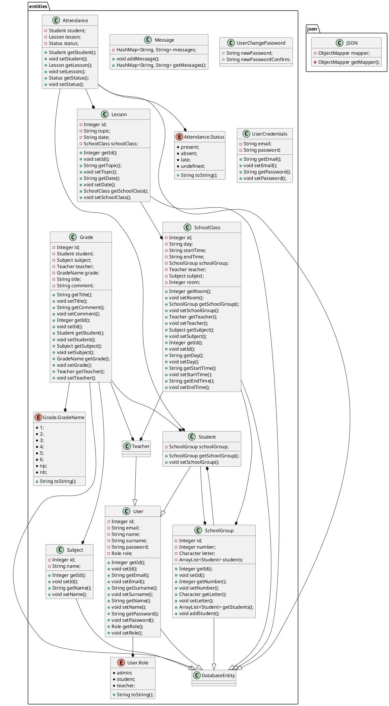

# Moduł entities
Moduł entities odpowiada za reprezentowanie danych poprzez obiekty. Moduł składa się z dwóch pakietów **entities** i **json**.

## Obiekt JSON
Klasa odpowiedzialna za przetwarzanie JSON, oparta o wzorzec singleton.
Atrybuty:
   * private static **JSON** instance - jedyna istniejąca instancja obiektu JSON
   * private **ObjectMapper** mapper - obiekt mappera Jackson
Metody:
   * private static **JSON** getInstance() - zwraca instancję obiektu JSON, jeżeli instancja nie istnieje tworzy ją
   * private **ObjectMapper** getMapper() - zwraca obiekt mappera
   * public static **T** parse() throws **JsonProcessingException** - zamienia JSON na obiekt Java wybranej klasy
   * public static **String** stringify() throws **JsonProcessingException** - zamienia obiekt Java na JSON

## Diagram UML Klas

