# Moduł GUI
Moduł GUI odpowiada za warstwę prezentacji aplikacji oraz interakcję z użytkownikiem. Został zbudowany w oparciu o framework JavaFX i wykorzystuje wzorzec projektowy MVC (Model-View-Controller), gdzie widoki definiowane są w plikach FXML, a logika ich obsługi zawarta jest w dedykowanych klasach kontrolerów.
Struktura modułu jest ściśle podzielona na pakiety odpowiadające rolom użytkowników oraz funkcjonalnościom wspólnym:

Pakiet admin: Zawiera podpakiety users, classes, subjects oraz schedule, które grupują kontrolery odpowiedzialne za pełne zarządzanie zasobami szkoły przez administratora.

Pakiet teacher: Składa się z kontrolerów umożliwiających nauczycielom realizację procesów dydaktycznych, takich jak tworzenie lekcji, zarządzanie ocenami oraz frekwencją.

Pakiet student: Zawiera komponenty pozwalające uczniom na selektywny wgląd w ich własne wyniki w nauce oraz statystyki obecności.

Pakiet shared: Grupuje klasy pomocnicze i uniwersalne widoki, takie jak panel logowania, ustawienia konta czy klasy narzędziowe AlertHelper i UIHelper.

## Diagram UML klas

```plantuml
@startuml
scale 0.8

package edziennikui {
    class HelloApplication
    class Launcher
    class HelloController {
		- Button btnDashboard
		- Button btnUsers
		- Button btnGrades
		- Button btnAttendance
		- Button btnSchedule
		- Button btnSettings
		- StackPane contentArea
		- User loggedUser
		+ void initSession(User user)
		+ void handleShowDashboard()
		+ void handleShowUsers()
		+ void handleShowGrades()
		+ void handleShowAttendance()
		+ void handleShowSchedule()
		+ void handleShowAccountSettings()
		+ void handleLogout(ActionEvent event)
		- void loadPage(String fxmlPath)
		- void showDashboard()
		- void showErrorAlert(String title, String message)
	}

    package shared {
		class LoginViewController {
			- TextField loginField
			- PasswordField passwordField
			- Label errorLabel
			+ void handleLogin(ActionEvent event)
			- void proceedToMainApp(User user, ActionEvent event)
			- void showError(String message)
		}
		
		class DashboardController {
			- Label lblUserRole
			+ void setInfo(User user)
		}
		
		class ScheduleController {
			- TableView<ScheduleRow> scheduleTable
			- TableColumn colTime
			- TableColumn colMonday
			- TableColumn colTuesday
			- TableColumn colWednesday
			- TableColumn colThursday
			- TableColumn colFriday
			+ void initialize()
			- void setupColumns()
			- void loadSchedule()
		}
		
		class AccountSettingsController {
			- TextField txtUsername
			- PasswordField pwdNew
			- PasswordField pwdConfirm
			- Label lblStatus
			+ void handleSaveSettings()
			+ void setUserInfo(User user)
			- void showError(String message)
		}
		
		class AlertHelper <<Utility>> {
			{static} + void showInfo(String title, String message)
			{static} + void showError(String title, String message)
			{static} + void showWarning(String title, String message)
			{static} + void showConfirmation(String title, String content)
			{static} - void showAlert(String title, String message, Alert.AlertType type)
		}
		
		class UIHelper <<Utility>> {
			{static} + void setupUserComboBox(ComboBox<User> combo)
			{static} + void setupClassComboBox(ComboBox<SchoolGroup> combo)
			{static} + void setupSubjectComboBox(ComboBox<Subject> combo)
			{static} + void openModal(String fxmlPath, String title, Consumer<T> controllerConsumer)
		}
    }

    package admin {
        package admin.classes {
			class AdminAddStudentToClassController {
				- TableView<User> availableStudentsTable
				- TableColumn colFirstName
				- TableColumn colLastName
				- TableColumn colEmail
				- int classId
				- boolean studentAdded
				+ void initialize()
				+ void setClassId(int classId)
				- void loadAvailableStudents()
				- void handleAdd()
				- void handleCancel()
			}

			class AdminClassDetailsController {
				- Label lblClassName
				- TableView<Student> studentTable
				- TableColumn colId
				- TableColumn colFirstName
				- TableColumn colLastName
				- TableColumn colEmail
				- int currentClassId
				+ void initialize()
				+ void setClassData(SchoolGroup schoolGroup)
				- void loadStudents(int classId)
				- void handleBack()
				- void handleAddStudentToClass()
				- void handleRemoveStudentFromClass()
			}
			
				class AdminClassFormController {
				- TextField txtNumber
				- TextField txtLetter
				+ void handleSave()
				+ void handleCancel()
				- void closeWindow()
			}

			class AdminClassListController {
				- TableView<SchoolGroup> classTable
				- TableColumn colId
				- TableColumn colNumber
				- TableColumn colLetter
				+ void initialize()
				- void loadClasses()
				- void handleShowDetails()
				- void handleAddClass()
				- void handleDeleteClass()
			}
        }
		
        package admin.users {
            class AdminUserListController {
				- TableView<User> userTable
				- TableColumn colId
				- TableColumn colName
				- TableColumn colSurname
				- TableColumn colEmail
				- TableColumn colRole
				- TextField txtSearch
				- ComboBox<String> comboFilterRole
				- FilteredList<User> filteredData
				+ void initialize()
				- void loadUsers()
				- void setupFiltering()
				- void applyFilters()
				- void handleAddUser()
				- void handleEditUser()
				- void handleDeleteUser()
			}
			
            class AdminUserFormController {
				- TextField txtName
				- TextField txtSurname
				- TextField txtEmail
				- TextField txtPassword
				- ComboBox<User.Role> comboRole
				- User currentUser
				- boolean isEditMode
				+ void initialize()
				+ void setUserData(User user)
				+ void handleSave()
				+ void handleCancel()
				- void closeWindow()
			}
        }
        package admin.subjects {
            class AdminSubjectListController {
				- TableView<Subject> subjectTable
				- TableColumn colId
				- TableColumn colName
				+ void initialize()
				- void loadSubjects()
				- void handleAddSubject()
				- void handleEditSubject()
				- void handleDeleteSubject()
			}
			
            class AdminSubjectFormController {
				- Label lblTitle
				- TextField txtSubjectName
				- Subject currentSubject
				- boolean isEditMode
				+ void setSubjectData(Subject subject)
				+ void handleSave()
				+ void handleCancel()
				- void closeWindow()
			}
        }
		
        package admin.schedule {
            class AdminScheduleManageController {
				- TableView<SchoolClass> scheduleTable
				- TableColumn colDay
				- TableColumn colTime
				- TableColumn colSubject
				- TableColumn colTeacher
				- TableColumn colRoom
				- ComboBox<SchoolGroup> comboFilterClass
				+ void initialize()
				- void setupTableColumns()
				- void loadInitialData()
				- void loadScheduleForClass(int classId)
				- void refreshTable()
				+ void handleAddLesson()
				+ void handleEditLesson()
				+ void handleDeleteLesson()
			}

            class AdminLessonFormController {
				- ComboBox<SchoolGroup> comboClass
				- ComboBox<Subject> comboSubject
				- ComboBox<User> comboTeacher
				- ComboBox<String> comboDay
				- ComboBox<String> comboLessonHour
				- TextField txtRoom
				+ void initialize()
				- void loadInitialData()
				- void setupDays()
				- void setupLessonHours()
				+ void handleSave()
				+ void handleCancel()
			}
        }
    }

    package teacher {
        class TeacherGradesController {
			- Label lblSelectedClass
			- Label lblSelectedSubject
			- TableView<StudentGradesRow> gradesTable
			- TableColumn colStudentName
			- TableColumn colGrades
			- TableColumn colAverage
			- TableColumn colAction
			- SchoolGroup currentGroup
			- Subject currentSubject
			+ void initialize()
			+ void setContext(SchoolGroup group, Subject subject)
			- void setupTableColumns()
			- void setupActionColumn()
			- void handleRefresh()
			- void openGradeForm(Student student)
			- void handleBack()
		}
		
		
        class TeacherGradeFormController {
			- Label lblStudentName
			- ComboBox<Integer> comboGradeValue
			- TextField txtCategory
			- TextArea txtComment
			- Student currentStudent
			- Subject currentSubject
			+ void initialize()
			+ void setGradeData(Student student, Subject subject)
			- void handleSave()
			- void handleCancel()
		}
		
        class TeacherAttendanceController {
			- TabPane mainTabPane
			- Tab tabAttendance
			- ComboBox<SchoolClass> comboClass
			- ComboBox<Subject> comboSubject
			- TextField txtTopic
			- TableView<Attendance> attendanceTable
			- TableColumn colStudentName
			- TableColumn colStatus
			- Label lblActiveLessonInfo
			- ApplicationClient client
			- int currentLessonId
			+ void initialize()
			- void setupTableColumns()
			- void handleCreateLesson()
			- void loadAttendanceList()
			- void handleSaveAttendance()
			- void refreshStudentList()
		}

        class TeacherClassSelectController {
			- ComboBox<SchoolGroup> comboClass
			- ComboBox<Subject> comboSubject
			+ void initialize()
			- void loadData()
			- void handleConfirmSelection()
		}
    }

    package student {
        class StudentGradesController {
			- TableView<SubjectGradeRow> gradesTable
			- TableColumn colSubject
			- TableColumn colGrades
			- TableColumn colDetails
			- TableColumn colAverage
			+ void initialize()
			- void setupMultiLineColumn(TableColumn column)
			- void loadGrades()
		}
		
        class StudentAttendanceController {
			- TableView<Attendance> attendanceTable
			- TableColumn colDate
			- TableColumn colLesson
			- TableColumn colSubject
			- TableColumn colStatus
			- Label lblAbsentCount
			- ApplicationClient client
			+ void initialize()
			- void loadAttendance()
			- void updateStats(ArrayList<Attendance> list)
		}
    }
}

edziennikui.Launcher ..> edziennikui.HelloApplication
edziennikui.HelloApplication --> edziennikui.HelloController

edziennikui.HelloController ..> edziennikui.shared
edziennikui.HelloController ..> edziennikui.admin
edziennikui.HelloController ..> edziennikui.teacher
edziennikui.HelloController ..> edziennikui.student

edziennikui.admin ..> edziennikui.shared.AlertHelper
edziennikui.teacher ..> edziennikui.shared.AlertHelper
edziennikui.student ..> edziennikui.shared.AlertHelper
edziennikui.shared.LoginViewController ..> edziennikui.shared.AlertHelper
edziennikui.HelloController ..> edziennikui.shared.UIHelper

hide methods
hide members
@enduml
```

