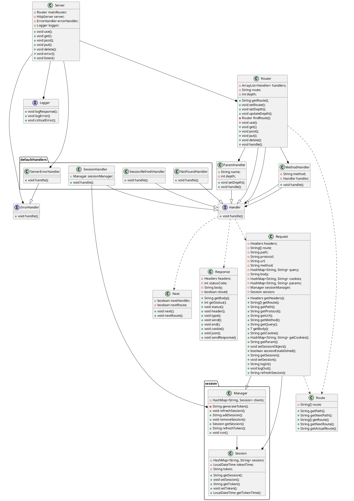

# Moduł JExp

JExp to moduł wzorowany na frameworku express.js dla środowiska Node.js. Moduł opakowuje wbudowany serwer HTTP, aby zapewnić szybkie i wygodne budowanie serwerów, a zwłaszcza REST API. Wykorzystuje obiekty, których zadaniem jest obsługa tras. Obiekty te są zapisywane w Roterach, które tworzą drzewiaste struktury i są odpowiedzialne za dopasowanie odpowiedniej trasy. Taka struktura zapewnia przetwarzanie potokowe, to znaczy przetwarzanie zgodne z kolejnością dodania obiektów.

## Sposób użycia

1. Serwer
   Obiekt serwera posiada metody pozwalające na dodawanie obiektów obsługi tras. Serwer ma wbudowany router, do którego przekazywane są obiekty żądania i odpowiedzi, a także obiekty obsługujące niedopasowaną trasę oraz błędy powstałe podczas działania.

```java
Server server=new Server;
serwer.use("/",handler1) // Dodanie obiektu obsługi trasy do wbudowanego routera
server.listen(port) // Serwer zaczyna nasłuchiwanie na wybranym porcie
```

2. Handler
   Obiekt obsługi trasy, posiada metodę handle która odpowiada za obsługę trasy do której obiekt jest przypisany.

```java
public class NewHandler implements Handler{
   public void handle(Request request, Response response, Next next) throws JExpError {
      // Obsługa trasy np: response.send("OK")
   }
}
```

3. Request
   Obiekt żądania, zawiera dane wysłane przez użytkownika, takie jak
    * nagłówki
    * adres URL
    * metodę HTTP
    * listę parametrów zapytania
    * ciało żądania
    * listę parametrów trasy
    * listę plików cookie

```java
request.getHeaders() // Zwraca wszystkie nagłówki HTTP
request.getQuery("query") // Zwraca wartość parametru zapytania o nazwie 'query', jeśli nie istnieje zwraca null 
request.getBody(Object.class) // Zwraca ciało żądania przekształcone na obiekt klasy 'Object'
request.getParam("a") // Zwraca wartość parametru trasy o nazwie 'a', jeśli nie istnieje zwraca null 
```

4. Response
   Obiekt odpowiedzi, odpowiada za wysłanie odpowiedzi do użytkownika.

```java
response.status(200) // Wysyła kod odpowiedzi '200 - OK'
response.header("Content-Type", "application/json") // Wysyła nagłówek 'Content-Type: application/json'
response.type("text/html") // Wysyła nagłówek 'Content-Type: text/html'
response.send("body") // Wysyła odpowiedź o treści 'body', zamyka wysyłanie danych
response.end() // Zamyka wysyłanie danych
response.json(object) //Obiekt 'object' zostaje przekształcony do json.JSON, następnie zostaje wysłany jako ciało żądania, ustawia 'Content-Type: application/json'
```

## Diagram UML klas

