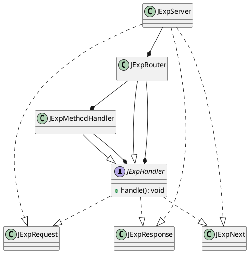
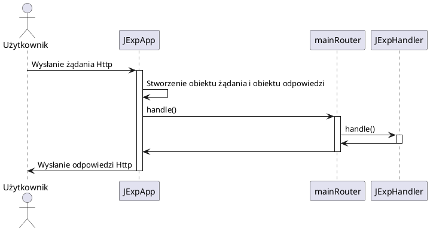
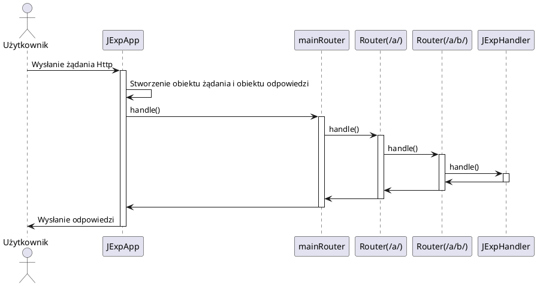
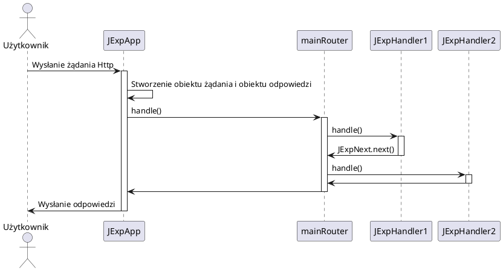

# Moduł JExp
JExp to moduł wzorowany na frameworku express.js dla środowiska Node.js. Moduł opakowuje wbudowany serwer HTTP, aby zapewnić szybkie i wygodne budowanie serwerów, a zwłaszcza REST API. Klasa **JExpServer** posiada główny router aplikacji odpowiedzialny za obsługę wszystkich tras. Do głównego routera mogą zostać inne routery obsługujące inne trasy, tworząc drzewiastą strukturę obsługującą trasy oraz zapewniającą przetwarzanie potokowe (przez co ważna jest kolejność dodawania tras). Taka struktura aplikacji jest możliwa dzięki użyciu wzorca Composite, każdy obiekt obsługujący żądanie rozszerza interfejs **JExpHandler**, przez co musi posiadać metodę **handle()**, która jest wywoływana stopniowo przez kolejne elementy, aż przetwarzanie żądania zostanie zakończone.

## Diagram UML klas

## Klasy i interfejsy

1. JExpHandler
   Interfejs, którego rozszerzeniem są obiekty obsługujące określone trasy.
   Metody:
      * public **void** handle() - metoda obsługująca żądanie HTTP
2. JExpMethodHandler
   Klasa rozszerzająca interfejs **JExpHandler**, obsługująca tylko żądania o wybranej metodzie HTTP.
   Atrybuty:
      * private **String** method - metoda żądania HTTP, którą obiekt może obsłużyć
   Metody:
      * public **void** handle() - metoda obsługująca żądanie HTTP tylko o metodzie podanej w atrybucie **method**
3. JExpRouter
   Klasa rozszerzająca interfejs **JExpHandler**, implementująca routing.
   Atrybuty:
      * private **HashMap<String, ArrayList<JExpHandler>>** handlers - tablica zawierająca odwzorowanie tras na obiekty obsługujące trasę
   Metody:
      * public **void** use() - metoda dodająca nowy obiekt obsługujący trasę do routera, dowolna metoda HTTP
      * public **void** get() - metoda dodająca nowy obiekt obsługujący trasę do routera, metoda HTTP *GET*
      * public **void** post() - metoda dodająca nowy obiekt obsługujący trasę do routera, metoda HTTP *POST*
      * public **void** put() - metoda dodająca nowy obiekt obsługujący trasę do routera, metoda HTTP *PUT*
      * public **void** delete() - metoda dodająca nowy obiekt obsługujący trasę do routera, metoda HTTP *DELETE*
      * public **void** method() - metoda dodająca nowy obiekt obsługujący trasę do routera, wybrana metoda HTTP
4. JExpServer
   Klasa zawierająca serwer HTTP oraz główny router serwera, do którego są dodawane obiekty obsługujące trasy.
   Atrybuty:
      * private **HttpServer** server
      * private **JExpRouter** mainRouter - główny router serwera
   Metody:
      * public **void** listen() - tworzy serwer HTTP, który rozpoczyna nasłuchiwanie na wybranym porcie
      * public **void** use() - metoda dodająca nowy obiekt obsługujący trasę do głównego routera, dowolna metoda HTTP
      * public **void** get() - metoda dodająca nowy obiekt obsługujący trasę do głównego routera, metoda HTTP *GET*
      * public **void** post() - metoda dodająca nowy obiekt obsługujący trasę do głównego routera, metoda HTTP *POST*
      * public **void** put() - metoda dodająca nowy obiekt obsługujący trasę do głównego routera, metoda HTTP *PUT*
      * public **void** delete() - metoda dodająca nowy obiekt obsługujący trasę do głównego routera, metoda HTTP *DELETE*
      * public **void** method() - metoda dodająca nowy obiekt obsługujący trasę do głównego routera, wybrana metoda HTTP
5. JExpRequest
   Klasa reprezentująca żądanie HTTP.
   Atrybuty:
   * private final **Headers** headers - obiekt nagłówków HTTP
   * private final **String[]** path - tablica ciągów znaków ułatwiająca dopasowanie żądania do trasy
   * private final **String** protocol - wersja protokołu
   * private final **String** url - adres URL razem z query string
   Metody:
   * public **Headers** getHeaders() - metoda zwracająca obiekt nagłówków HTTP
   * public **String[]** getPath() - metoda zwracająca tablicę ciągów znaków ułatwiających dopasowanie trasy
   * public **String** getProtocol() - metoda zwracająca wersję protokołu
   * public **String** getUrl() - metoda zwracająca adres URL razem z query string
6. JExpResponse
   Klasa reprezentująca odpowiedź HTTP.
   Atrybuty:
   Metody:

## Diagramy sekwencji

### Obsługa żądanie HTTP
1. Brak routerów zagnieżdżonych, jeden obiekt obsługi trasy

2. Router zagnieżdżony, jeden obiekt obsługujący trasę

3. Brak routerów zagnieżdżonych, dwa obiekty obsługujące trasę trasy
