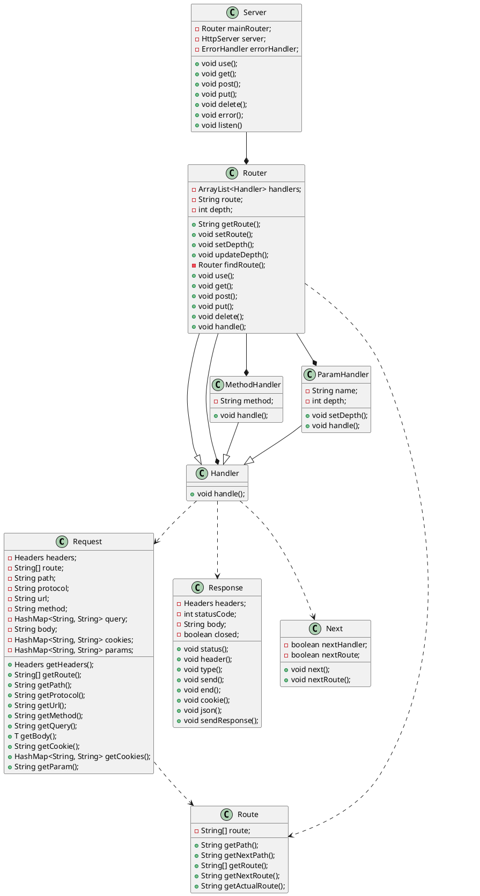
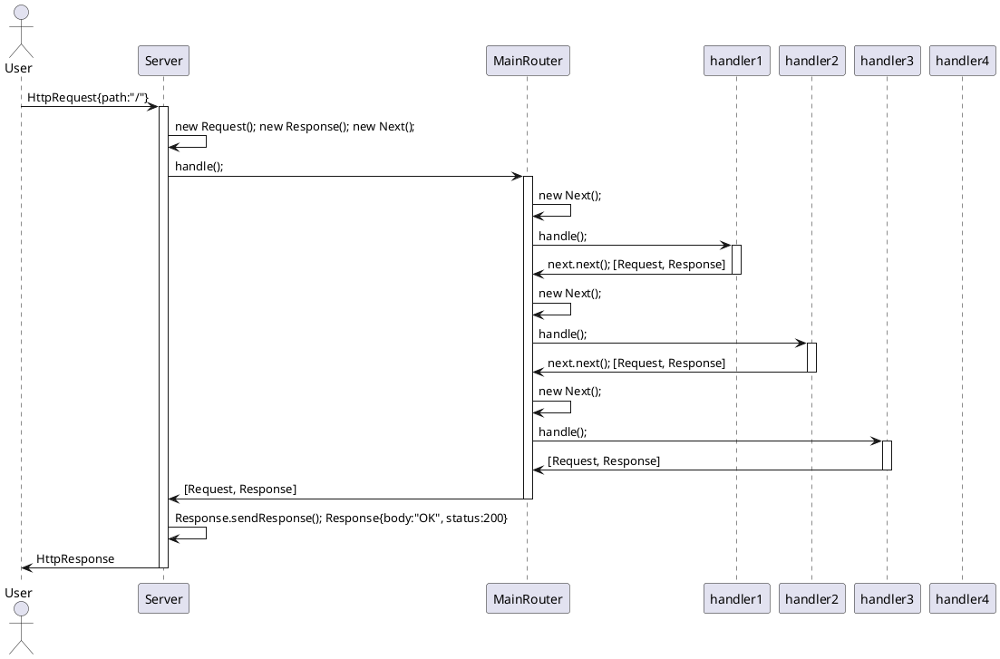
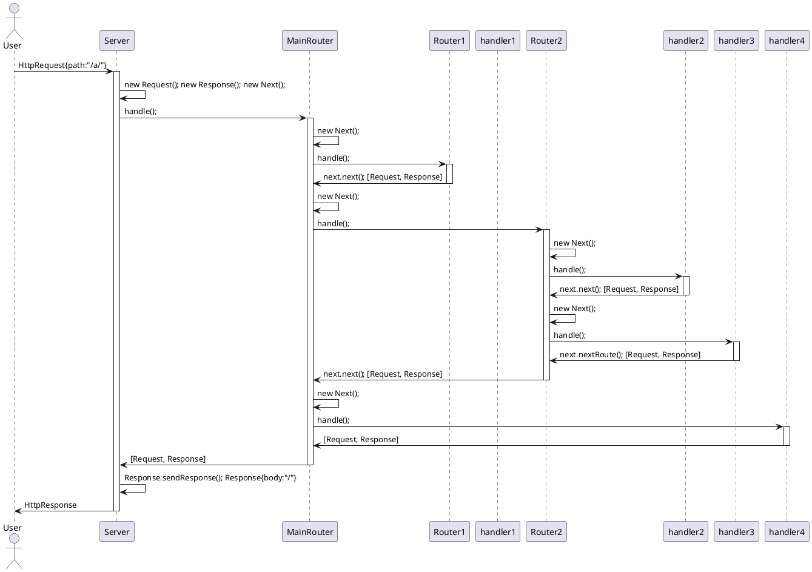
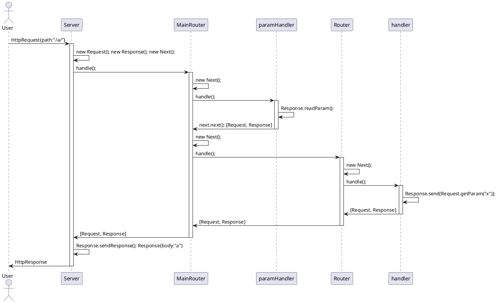

# Moduł JExp
 JExp to moduł wzorowany na frameworku express.js dla środowiska Node.js. Moduł opakowuje wbudowany serwer HTTP, aby zapewnić szybkie i wygodne budowanie serwerów, a zwłaszcza REST API. Wykorzystuje obiekty, których zadaniem jest obsługa tras. Obiekty te są zapisywane w Roterach, które tworzą drzewiaste struktury i są odpowiedzialne za dopasowanie odpowiedniej trasy. Taka struktura zapewnia przetwarzanie potokowe, to znaczy przetwarzanie zgodne z kolejnością dodania obiektów.

## Sposób użycia
1. Serwer
Obiekt serwera posiada metody pozwalające na dodawanie obiektów obsługi tras. Serwer ma wbudowany router, do którego przekazywane są obiekty żądania i odpowiedzi, a także obiekty obsługujące niedopasowaną trasę oraz błędy powstałe podczas działania.
```java
Server server=new Server;
serwer.use("/",handler1) // Dodanie obiektu obsługi trasy do wbudowanego routera
server.listen(port) // Serwer zaczyna nasłuchiwanie na wybranym porcie
```
2. Handler
Obiekt obsługi trasy, posiada metodę handle która odpowiada za obsługę trasy do której obiekt jest przypisany.
```java
public class NewHandler implements Handler{
   public void handle(Request request, Response response, Next next) throws JExpError {
      // Obsługa trasy np: response.send("OK")
   }
}
```

3. Request
Obiekt żądania, zawiera dane wysłane przez użytkownika, takie jak
   * nagłówki
   * adres URL
   * metodę HTTP
   * listę parametrów zapytania
   * ciało żądania
   * listę parametrów trasy
   * listę plików cookie
```java
request.getHeaders() // Zwraca wszystkie nagłówki HTTP
request.getQuery("query") // Zwraca wartość parametru zapytania o nazwie 'query', jeśli nie istnieje zwraca null 
request.getBody(Object.class) // Zwraca ciało żądania przekształcone na obiekt klasy 'Object'
request.getParam("a") // Zwraca wartość parametru trasy o nazwie 'a', jeśli nie istnieje zwraca null 
```

4. Response
Obiekt odpowiedzi, odpowiada za wysłanie odpowiedzi do użytkownika.
```java
response.status(200) // Wysyła kod odpowiedzi '200 - OK'
response.header("Content-Type", "application/json") // Wysyła nagłówek 'Content-Type: application/json'
response.type("text/html") // Wysyła nagłówek 'Content-Type: text/html'
response.send("body") // Wysyła odpowiedź o treści 'body', zamyka wysyłanie danych
response.end() // Zamyka wysyłanie danych
response.json(object) //Obiekt 'object' zostaje przekształcony do JSON, następnie zostaje wysłany jako ciało żądania, ustawia 'Content-Type: application/json'
```

## Diagram UML klas



## Klasy i interfejsy
### Obiekty żądań i odpowiedzi
1. Request
   Klasa reprezentująca żądanie HTTP.
   Atrybuty:
      * private final **Headers** headers - obiekt przechowujący nagłówki żądania
      * private final **String[]** route - tablica odpowiadająca za wybranie odpowiedniej trasy
      * private final **String** path - ścieżka żądania
      * private final **String** protocol - protokół żądania
      * private final **String** url - adres URL żądania
      * private final **String** method - metoda HTTP żądania
      * private final **HashMap<String, String>** query - query string
      * private final **String** body - ciało żądania
      * private final **HashMap<String, String>** cookies - pliki cookie żądania
      * private final **HashMap<String, String>** params - lista parametrów trasy
   Metody:
      * public **Headers** getHeaders() - metoda zwracająca obiekt nagłówków HTTP
      * public **String[]** getRoute() - metoda zwracająca trasę żądania
      * public **String** getPath() - metoda zwracająca ścieżkę żądania
      * public **String** getProtocol() - metoda zwracająca wersję protokołu
      * public **String** getUrl() - metoda zwracająca adres URL razem z query string
      * public **String** getMethod() - metoda zwracająca metodę użytą w żądaniu HTTP
      * public **String** getQuery() - metoda zwracająca wartość wybranego atrybutu z query string
      * public **T** getBody() throws **RequestError** - metoda przekształcająca ciało żądania na obiekt java
      * public **String** getCookie() - metoda zwracająca wybrany plik cookie
      * public **HashMap<String, String>** getCookies() - metoda zwracająca wszystkie pliki cookie
      * public **void** readParam() - wczytuje parametr trasy z trasy, zamienia parametr podany w trasie żądania na nazwę parametru, aby żądanie zostało dopasowane do odpowiedniej trasy
      * public **String** getParam() - zwraca wartość parametru o podanej nazwie

2. Response
   Klasa reprezentująca odpowiedź HTTP.
   Atrybuty:
      * private final Headers headers - obiekt nagłówków HTTP
      * private int statusCode - kod odpowiedzi HTTP
      * private String body - ciało odpowiedzi
      * private boolean closed - flaga informująca o statusie ciała odpowiedzi
   Metody:
      * public **void** status() - ustawia status HTTP odpowiedzi
      * public **void** header() - dodaje nowy nagłówek HTTP
      * public **void** type() - ustawia typ odpowiedzi
      * public **void** send() throws **Response.ResponseError** - wysyła dane, blokuje wysłanie następnych danych, jeśli już zablokowane rzuca wyjątek rzuca wyjątek
      * public **void** end() throws **Response.ResponseError** - blokuje wysyłanie danych, jeśli już zablokowane rzuca wyjątek
      * public **void** cookie() - zapisuje nowy plik cookie
      * public **void** json() - ustawia ciało żądania na JSON zamieniony z wybranego obiektu, blokuje wysłanie następnych danych, jeśli już zablokowane rzuca wyjątek rzuca wyjątek
      * public **void** sendResponse() throws **IOException** - wysyła odpowiedź HTTP
Przykład użycia:

3. Next
   Klasa pozwalająca pomijać funkcje obsługi tras.
   Atrybuty:
      * private **boolean** nextHandler - jeśli prawda przechodzi do następnego obiektu obsługującego trasę
      * private **boolean** nextRoute - jeśli prawda przechodzi do nastepnej dopasowanej trasy
   Metody:
      * public **void** next() throws **Next.NextError** - przechodzi do następnego obiektu obsługującego trasę, wyrzuca wyjątek po drugim wywołaniu
      * public **void** nextRoute() throws **Next.NextError** - przechodzi do nastepnej dopasowanej trasy, wyrzuca wyjątek po drugim wywołaniu

### Obiekty obsługujące trasy
1. Handler
   Interfejs, którego rozszerzeniem są obiekty obsługujące określone trasy.
   Metody:
      * public **void** handle() - metoda obsługująca żądanie HTTP
2. MethodHandler
   Klasa rozszerzająca interfejs **Handler**, obsługująca tylko żądania o wybranej metodzie HTTP.
   Atrybuty:
      * private **String** method - metoda żądania HTTP, którą obiekt może obsłużyć
      * private **Handler** handler - obiekt obsługujący trasę o podanej metodzie
   Metody:
      * public **void** handle() - metoda obsługująca żądanie HTTP tylko o metodzie podanej w atrybucie **method**
3. ParamHandler
   Klasa rozszerzająca interfejs **Handler**, odczytuje parametr trasy żądania.
   Atrybuty:
      * private final **String** name - nazwa parametru trasy
      * private **int** depth - głębokość w trasie
   Metody:
      * public **void** setDepth() - ustawia głębokość
      * public **void** handle() throws **JExpError** - metoda obsługująca żądanie HTTP, odczytuje parametr trasy żądania
4. Router
   Klasa implementująca przetwarzanie potokowe i trasowanie.
   Atrybuty:
      * private final **ArrayList<Handler>** handlers - lista obiektów obsługi tras
      * private **String** route - nazwa węzła trasy
      * private **int** depth - głębokość w trasie
   Metody:
      * public **String** getRoute() - zwraca nazwę węzła trasy
      * public **void** setRoute() - ustawia nazwę węzła trasy
      * public **void** setDepth() - ustawia głębokość
      * public **void** updateDepth() - aktualizuje głębokość we wszystkich podległych obiektach
      * private Router findRoute() - przeszukuje listę obiektów obsługi tras, w poszukiwaniu routera o podanej nazwie węzła trasy
      * public **void** use() throws **RouterError** - dodaje obiekt obsługi trasy do listy obiektów obsługi trasy
      * public **void** get() throws **RouterError** - dodaje obiekt obsługi trasy, który jest aktywny, tylko gdy żądanie posiada metodę HTTP 'GET', opakowuje obiekt w obiekt klasy 'MethodHandler'
      * public **void** post() throws **RouterError** - dodaje obiekt obsługi trasy, który jest aktywny, tylko gdy żądanie posiada metodę HTTP 'POST', opakowuje obiekt w obiekt klasy 'MethodHandler'
      * public **void** put() throws **RouterError** - dodaje obiekt obsługi trasy, który jest aktywny, tylko gdy żądanie posiada metodę HTTP 'PUT', opakowuje obiekt w obiekt klasy 'MethodHandler'
      * public **void** delete() throws **RouterError** - dodaje obiekt obsługi trasy, który jest aktywny, tylko gdy żądanie posiada metodę HTTP 'DELETE', opakowuje obiekt w obiekt klasy 'MethodHandler'
      * public **void** handle() - metoda obsługująca żądanie HTTP
5. Server
   Wrapper serwera HTTP java.
   Atrybuty:
      * private **Router** mainRouter - główny router serwera, do którego dodawane są obiekty obsługi tras
      * private **HttpServer** server - instancja serwera HTTP
      * private **ErrorHandler** errorHandler - obiekt obsługujący błędy serwera
   Metody:
      * public **void** use() throws **RouterError** - dodaje obiekt obsługi trasy do głównego routera serwera
      * public **void** get() throws **RouterError** - dodaje obiekt obsługi trasy, który jest aktywny, tylko gdy żądanie posiada metodę HTTP 'GET', opakowuje obiekt w obiekt klasy 'MethodHandler'
      * public **void** post() throws **RouterError** - dodaje obiekt obsługi trasy, który jest aktywny, tylko gdy żądanie posiada metodę HTTP 'POST', opakowuje obiekt w obiekt klasy 'MethodHandler'
      * public **void** put() throws **RouterError** - dodaje obiekt obsługi trasy, który jest aktywny, tylko gdy żądanie posiada metodę HTTP 'PUT', opakowuje obiekt w obiekt klasy 'MethodHandler'
      * public **void** delete() throws **RouterError** - dodaje obiekt obsługi trasy, który jest aktywny, tylko gdy żądanie posiada metodę HTTP 'DELETE', opakowuje obiekt w obiekt klasy 'MethodHandler'
      * public **void** error() - ustawia obiekt obsługi błędów serwera
      * public **void** listen() throws **RouterError** - tworzy serwer, który rozpoczyna nasłuchiwanie na podanym porcie aplikacji, dodaje domyślny obiekt obsługi niedopasowanych tras, aktualizuję strukturę routerów zapisanych w głównym routerze serwera

### Obiekty dodatkowe
1. Route
   Klasa przetwarzająca ścieżkę żądania.
   Atrybuty:
      * private final **String[]** route - trasa otrzymana z przetworzenia podanej ścieżki
   Metody:
      * public **String** getPath() - zwraca pełną ścieżkę
      * public **String** getNextPath() - zwraca ścieżkę od następnego węzła
      * public **String[]** getRoute() - zwraca pełną trasę
      * public **String** getNextRoute() - zwraca trasę od następnego węzła
      * public **String** getActualRoute() - zwraca nazwę aktualnego węzła trasy

## Wyjątki
1. JExpError - ogólna klasa wyjątku
2. Request - wyjątek obiektu żądania
2. ResponseError - wyjątek obiektu odpowiedzi
3. NextError - wyjątek obiektu odpowiedzialnego za przetwarzanie potokowe
4. RouterError - wyjątek obiektu routera

## Diagramy sekwencji

1. Przetwarzanie potokowe

``` java
Server server=new Server();
Handler handler1=new Handler(){
   @Override
   public void handle(Request request, Response response, Next next) throws JExpError
   {
      next.next();
   }
};
Handler handler2=new Handler(){
   @Override
   public void handle(Request request, Response response, Next next) throws JExpError
   {
      next.next();
   }
};
Handler handler3=new Handler(){
   @Override
   public void handle(Request request, Response response, Next next) throws JExpError
   {
      res.send("Response");
   }
};
Handler handler4=new Handler(){
   @Override
   public void handle(Request request, Response response, Next next) throws JExpError
   {
      res.status(404);
   }
};
server.use("/", handler1);
server.use("/", handler2);
server.use("/", handler3);
server.use("/", handler4);
server.listen(port);
```


2. Trasowanie
```java
Server server=new Server();
Handler handler1=new Handler(){
   @Override
   public void handle(Request request, Response response, Next next) throws JExpError
   {
      response.send("/c/");
   }
};
Handler handler2=new Handler(){
   @Override
   public void handle(Request request, Response response, Next next) throws JExpError
   {
      next.next();
   }
};
Handler handler3=new Handler(){
   @Override
   public void handle(Request request, Response response, Next next) throws JExpError
   {
      next.nextRoute();
   }
};
Handler handler4=new Handler(){
   @Override
   public void handle(Request request, Response response, Next next) throws JExpError
   {
      response.send("/");
   }
};
server.use("/c/", handler1);
server.use("/a/", handler2);
server.use("/a/", handler3);
server.use("/", handler4);
server.listen(port);
```

3. Parametry trasy
```java
Server server=new Server();
Handler handler=new Handler(){
   @Override
   public void handle(Request request, Response response, Next next) throws JExpError
   {
      response.send(request.getParam("x"));
   }
};
server.use("/:x/", handler);
server.listen(port);
```
