# Moduł server
Moduł server jest głównym modułem w działaniu serwera HTTP. Zawiera plik *Main.java*, czyli główną instancję serwera, oraz klasy obsługujące poszczególne endpointy API. Korzysta z modułu **jexp** i **database**.

## Endpointy API

1. Uwierzytelnianie
    * `/` - odczytanie nagłówka `Authorization` i znalezienie odpowiedniego obiektu sesji, jeżeli taki nie zostanie znaleziony przechodzi do następnej dopasowanej trasy
    * `/session/` **GET** - endpoint odświeżający token uwierzytelniania, ***obsługuje tylko uwierzytelnionych użytkowników!!!***
    * `/login/` **POST** - logowanie i ustawianie sesji, jeżeli użytkownik jest uwierzytelniony przechodzi do następnej trasy, jeżeli użytkownik podał nieprawidłowe dane zwraca odpowiedź o statusie **400**, w przeciwnym wypadku ustanawia sesję i przesyła użytkownikowi token uwierzytelniania 
    * `/logout/` **GET** - wylogowanie i zniszczenie sesji, ***obsługuje tylko uwierzytelnionych użytkowników!!!***
    * `/self/` **GET** - dane użytkownika, ***obsługuje tylko uwierzytelnionych użytkowników!!!***
2. Konta użytkowników
    * `/user/` **GET** - lista wszystkich użytkowników, ***obsługuje tylko uwierzytelnionych użytkowników z uprawnieniami administratora!!!***
    * `/user/` **POST** - tworzy nowego użytkownika, ***obsługuje tylko uwierzytelnionych użytkowników z uprawnieniami administratora!!!***
    * `/self/password/` **POST** - zmienia hasło do konta, ***obsługuje tylko uwierzytelnionych użytkowników!!!***
3. Przedmioty szkolne
    * `/subject/` **GET** - lista wszystkich przedmiotów, ***obsługuje tylko uwierzytelnionych użytkowników z uprawnieniami administratora!!!***
    * `/subject/` **POST** - tworzy nowy przedmiot, ***obsługuje tylko uwierzytelnionych użytkowników z uprawnieniami administratora!!!***
4. Klasy
    * `/class/` **GET** - lista wszystkich klas, ***obsługuje tylko uwierzytelnionych użytkowników z uprawnieniami administratora!!!***
    * `/class/` **POST** - tworzy nową klasę, ***obsługuje tylko uwierzytelnionych użytkowników z uprawnieniami administratora!!!***
5. Uczniowie
    * `/student/` **GET** - lista wszystkich uczniów , ***obsługuje tylko uwierzytelnionych użytkowników z uprawnieniami administratora!!!***
    * `/student/:classId/` **GET** - lista uczniów w klasie o id **classId**, ***obsługuje tylko uwierzytelnionych użytkowników z uprawnieniami administratora!!!***
    * `/student/` **POST** - dodaje wybranego ucznia do wybranej klasy, ***obsługuje tylko uwierzytelnionych użytkowników z uprawnieniami administratora!!!***
6. Plan zajęć
    * `/timetable/:classId/` **GET** - lista zajęć z planu zajęć klasy, ***obsługuje tylko uwierzytelnionych użytkowników z uprawnieniami administratora!!!***
    * `/timetable/` **POST** - dodawania zajęć do planu zajęć klasy, ***obsługuje tylko uwierzytelnionych użytkowników z uprawnieniami administratora!!!***
    * `/self/timetable/` **GET** - wyświetlanie planu zajęć, ***obsługuje tylko uwierzytelnionych użytkowników z uprawnieniami ucznia lub nauczyciela!!!*** 
7. Lekcje
    * `/lesson/` **GET** - wyświetlanie listy ostatnich lekcji, ***obsługuje tylko uwierzytelnionych użytkowników z uprawnieniami nauczyciela!!!***
    * `/lesson/` **POST** - dodawanie lekcji, ***obsługuje tylko uwierzytelnionych użytkowników z uprawnieniami nauczyciela!!!***
8. Obecność na zajęciach
    * `/attendance/:lessonId/` **GET** - wyświetlanie listy obecności na lekcji, ***obsługuje tylko uwierzytelnionych użytkowników z uprawnieniami nauczyciela!!!***
    * `/attendance/:lessonId/` **PUT** - aktualizacja obecności ucznia na lekcji, ***obsługuje tylko uwierzytelnionych użytkowników z uprawnieniami nauczyciela!!!***
    * `/self/attendance/` **GET** - wyświetlanie obecności, ***obsługuje tylko uwierzytelnionych użytkowników z uprawnieniami ucznia!!!*** 
9. Oceny
    * `/grade/:studentId/` **GET** - wyświetlanie ocen ucznia, ***obsługuje tylko uwierzytelnionych użytkowników z uprawnieniami nauczyciela!!!***
    * `/grade/:studentId/` **POST** - dodawanie oceny ucznia, ***obsługuje tylko uwierzytelnionych użytkowników z uprawnieniami nauczyciela!!!***
    * `/self/grade/` **GET** - wyświetlanie ocen, ***obsługuje tylko uwierzytelnionych użytkowników z uprawnieniami ucznia!!!***

## Diagram UML klas

```plantuml
@startuml
class MainLogger{
    - String name;
    - String messageInfo();
    + void logResponse();
    + void logError();
    + void criticalError();
}
class DatabaseHandler{
    - ApplicationDatabase database;
    + void handle();
}
package "attendance"{
class LessonAttendanceListHandler{
    + void handle();
}
class LessonAttendanceUpdateHandler{
    + void handle();
}
class StudentAttendanceHandler{
    + void handle();
}
}
package "authentication"{
class AuthenticationHandler{
	+ void handle();
}
class SessionDestroyHandler{
	+ void handle();
}
class UpdateUserPasswordHandler{
	+ void handle();
}
class UserDataHandler{
	+ void handle();
}
}
package "authorization"{
class AdminOnlyHandler{
	+ void handle();
}
class AdminTeacherOnlyHandler{
	+ void handle();
}
class AuthenticatedUsersOnlyHandler{
	+ void handle();
}
class StudentOnlyHandler{
	+ void handle();
}
class TeacherOnlyHandler{
	+ void handle();
}
}
package "classes"{
class AllClassesHandler{
	+ void handle();
}
class CreateClassHandler{
	+ void handle();
}
}
package "grades"{
class AddGradeHandler{
	+ void handle();
}
class StudentGradesHandler{
	+ void handle();
}
class TeacherGradesListHandler{
	+ void handle();
}
}
package "lessons"{
class AddLessonHandler{
	+ void handle();
}
class TeacherLessonsHandler{
	+ void handle();
}
}
package "students"{
class AddStudentHandler{
	+ void handle();
}
class AllStudentsHandler{
	+ void handle();
}
class StudentsClassHandler{
	+ void handle();
}
}
package "subjects"{
class AllSubjectsHandler{
	+ void handle();
}
class CreateSubjectHandler{
	+ void handle();
}
}
package "timeTable"{
class AddClassTimeTableHandler{
	+ void handle();
}
class ClassTimeTableHandler{
	+ void handle();
}
class StudentTimeTableHandler{
	+ void handle();
}
class TeacherTimeTableHandler{
	+ void handle();
}
}
package "users"{
class AllUsersHandler{
	+ void handle();
}
class CreateUserHandler{
	+ void handle();
}
}
attendance.LessonAttendanceListHandler--|>DatabaseHandler
attendance.LessonAttendanceUpdateHandler--|>DatabaseHandler
attendance.StudentAttendanceHandler--|>DatabaseHandler
authentication.AuthenticationHandler--|>DatabaseHandler
authentication.UpdateUserPasswordHandler--|>DatabaseHandler
authentication.UserDataHandler--|>DatabaseHandler
classes.AllClassesHandler--|>DatabaseHandler
classes.CreateClassHandler--|>DatabaseHandler
grades.AddGradeHandler--|>DatabaseHandler
grades.StudentGradesHandler--|>DatabaseHandler
grades.TeacherGradesListHandler--|>DatabaseHandler
lessons.AddLessonHandler--|>DatabaseHandler
lessons.TeacherLessonsHandler--|>DatabaseHandler
students.AddStudentHandler--|>DatabaseHandler
students.AllStudentsHandler--|>DatabaseHandler
students.StudentsClassHandler--|>DatabaseHandler
subjects.AllSubjectsHandler--|>DatabaseHandler
subjects.CreateSubjectHandler--|>DatabaseHandler
timeTable.AddClassTimeTableHandler--|>DatabaseHandler
timeTable.ClassTimeTableHandler--|>DatabaseHandler
timeTable.StudentTimeTableHandler--|>DatabaseHandler
timeTable.TeacherTimeTableHandler--|>DatabaseHandler
users.AllUsersHandler--|>DatabaseHandler
users.CreateUserHandler--|>DatabaseHandler
@enduml
```

