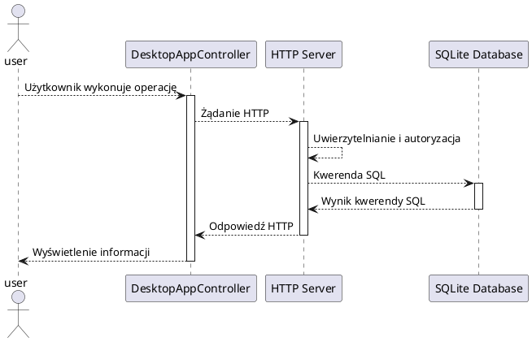

# Aplikacja e-dziennik

## Spis treści
1. [Opis projektu](#opis-projektu)
2. [Aktorzy systemu](#aktorzy-systemu)
3. [Działanie systemu](#działanie-systemu)

## Opis projektu
Aplikacja e‑Dziennik to system wspierający pracę szkół poprzez umożliwienie elektronicznego zarządzania ocenami, obecnościami oraz planem lekcji. Aplikacja działa w architekturze klient-serwer używając protokołu HTTP (REST API) do przysyłania danych oraz bazy danych SQLite, aby zapewnić funkcjonalny i wydajny dostęp do danych. 

## Aktorzy systemu
Najważniejsze funkcje są zaznaczone pogrubioną czcionką.

1. Administrator(admin)
   * **wyświetlanie listy użytkowników**
   * **dodawanie użytkowników**
   * edytowanie kont użytkowników
   * usuwanie użytkowników
   * **wyświetlanie listy przedmiotów**
   * **dodawanie przedmiotów do listy przedmiotów**
   * edytowanie przedmiotu z listy przedmiotów
   * usuwanie przedmiotu z listy przedmiotów
   * **wyświetlanie listy klas**
   * **dodawanie klas do listy klas**
   * edytowanie klasy z listy klas
   * usuwanie klasy z listy klas
   * **wyświetlanie listy uczniów**
   * **dodawanie uczniów do listy uczniów**
   * edytowanie ucznia z listy uczniów
   * **wyświetlanie listy nauczycieli**
   * **dodawanie nauczyciela do listy nauczycieli**
   * edytowanie nauczyciela z listy nauczycieli
   * usuwanie nauczyciela z listy nauczycieli
   * **wyświetlanie uczniów w klasie**
   * **dodawanie ucznia do klasy**
   * usuwanie ucznia z klasy
   * **wyświetlanie planu zajęć**
   * **dodawanie planu zajęć**
   * **usuwanie planu zajęć**
   * **dodawanie zajęć do planu zajęć**
   * edytowanie zajęć z planu zajęć
   * usuwanie zajęć z planu zajęć
2. Nauczyciel(teacher)
   * **wyświetlanie listy klasy**
   * **wyświetlanie listy obecności**
   * **dodawanie obecności ucznia na lekcji**
   * edytowanie obecności ucznia na lekcji
   * **wyświetlanie ocen ucznia**
   * **dodawanie oceny ucznia**
   * edytowanie oceny ucznia
   * usuwanie oceny ucznia
   * wyświetlanie danych konta
   * edytowanie danych konta
3. Uczeń(student)
   * **wyświetlanie planu zajęć**
   * **wyświetlanie obecności**
   * **wyświetlanie ocen**
   * wyświetlanie danych konta
   * edytowanie danych konta

## Działanie aplikacji
Interfejs użytkownika zaimplementowany przy użyciu Java FX przy każdej operacji wysyła odpowiednie żądanie HTTP do odpowiedniego punktu końcowego. Serwer odbiera żądanie i wykonuje odpowiedni kod odpowiedzialny za obsługę wybranego punktu końcowego, oraz wysyła odpowiedź razem z odpowiednim kodem odpowiedzi HTTP. Aby używać aplikacji użytkownik musi być uwierzytelniony. Sesja logowania jest utrzymywana dzięki plikom cookie, zawierającym unikalny numer identyfikacyjny użytkownika generowany każdorazowo przy ustanawianiu sesji, zapisanym po stronie użytkownika. Serwer odczytuje numer, który umożliwia identyfikację użytkownika po stronie serwera.

### Ogólny schemat działania aplikacji

## Więcej dokumentacji

* [baza danych](./docs/database.md)