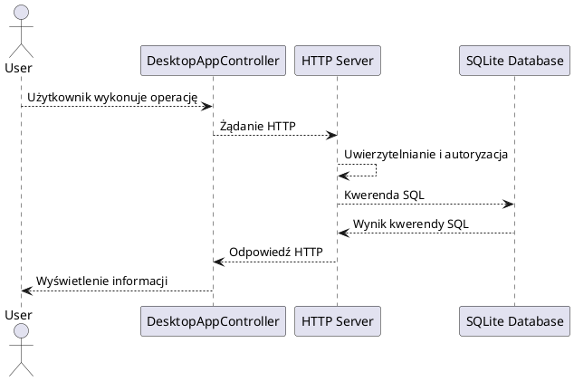
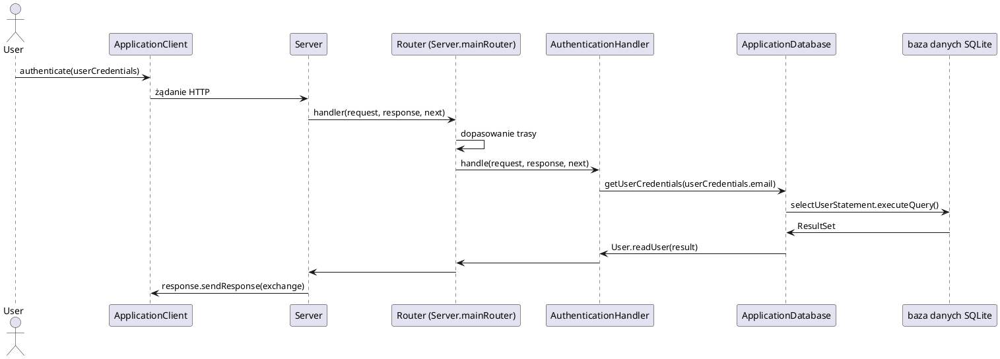

# Aplikacja e-dziennik

## Spis treści

1. [Opis projektu](#opis-projektu)
2. [Aktorzy systemu](#aktorzy-systemu)
3. [Działanie systemu](#działanie-systemu)
4. [Serwer i endpointy API](#serwer-i-endpointy-api)

## Opis projektu

Aplikacja e‑Dziennik to system wspierający pracę szkół poprzez umożliwienie elektronicznego zarządzania ocenami, obecnościami oraz planem lekcji. Aplikacja działa w architekturze klient-serwer używając protokołu HTTP (REST API) do przysyłania danych oraz bazy danych SQLite, aby zapewnić funkcjonalny i wydajny dostęp do danych.

## Aktorzy systemu

Najważniejsze funkcje są zaznaczone pogrubioną czcionką.

1. Administrator(admin)
    * wyświetlanie listy użytkowników (`/user/` **GET**)
    * dodawanie użytkowników (`/user/` **POST**)
    * wyświetlanie listy przedmiotów (`/subject/` **GET**)
    * dodawanie przedmiotów do listy przedmiotów(`/subject/` **POST**)
    * wyświetlanie listy klas (`/class/` **GET**)
    * dodawanie klas do listy klas (`/class/` **POST**)
    * wyświetlanie listy uczniów (`/student/` **GET**)
    * wyświetlanie listy uczniów klasy (`/student/:classId` **GET**)
    * dodawania ucznia do klasy (`/student/` **POST**)
    * wyświetlanie planu zajęć klasy (`/timetable/:classId` **GET**)
    * dodawania zajęć do planu zajęć klasy (`/timetable/:classId` **POST**)
2. Nauczyciel(teacher)
    * wyświetlanie listy uczniów klasy (`/student/:classId`, **GET**)
    * wyświetlanie listy ostatnich lekcji (`/lesson/` **GET**)
    * dodawanie lekcji (`/lesson/` **POST**)
    * wyświetlanie listy obecności na lekcji (`/attendance/:lessonId/` **GET**)
    * aktualizacja obecności ucznia na lekcji (`/attendance/:lessonId/` **PUT**)
    * wyświetlanie ocen ucznia wystawionych przez zalogowanego nauczyciela (`/grade/:studentId/` **GET**)
    * dodawanie oceny ucznia (`/grade/:studentId/` **POST**)
3. Uczeń(student)
    * wyświetlanie planu zajęć (`/self/timetable/` **GET**)
    * wyświetlanie obecności (`/self/attendance/` **GET**)
    * wyświetlanie ocen  (`/self/grade/` **GET**)

## Działanie aplikacji

Interfejs użytkownika zaimplementowany przy użyciu Java FX przy każdej operacji wysyła odpowiednie żądanie HTTP do odpowiedniego punktu końcowego. Serwer odbiera żądanie i wykonuje odpowiedni kod odpowiedzialny za obsługę wybranego punktu końcowego, oraz wysyła odpowiedź razem z odpowiednim kodem odpowiedzi HTTP. Aby używać aplikacji użytkownik musi być uwierzytelniony. Sesja logowania jest utrzymywana dzięki tokenom uwierzytelniania, zawierającym unikalny numer identyfikacyjny użytkownika generowany każdorazowo przy ustanawianiu sesji, zapisanym po stronie użytkownika, token jest dodawany do żądania poprzez nagłówek `Authorization`. Serwer odczytuje numer,który umożliwia identyfikację użytkownika po stronie serwera.

### Ogólny schemat działania aplikacji

### Diagramy usecase

#### Uwierzytelnianie

## Więcej dokumentacji

* [serwer HTTP](./docs/server.md)
* [baza danych](./docs/database.md)
* [encje](./docs/entities.md)
* [klient HTTP](./docs/client.md)
* [moduł jexp](./docs/jexp.md)

## TODO

1. Zaimplementować managera sesji tak jak bazę danych - każdy obiekt obsługi trasy powinien b=posiadać referencję do managera sesji