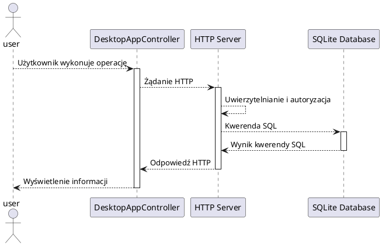

# Aplikacja e-dziennik

## Spis treści
1. [Opis projektu](#opis-projektu)
2. [Aktorzy systemu](#aktorzy-systemu)
3. [Działanie systemu](#działanie-systemu)
4. [Serwer i endpointy API](#serwer-i-endpointy-api)

## Opis projektu
Aplikacja e‑Dziennik to system wspierający pracę szkół poprzez umożliwienie elektronicznego zarządzania ocenami, obecnościami oraz planem lekcji. Aplikacja działa w architekturze klient-serwer używając protokołu HTTP (REST API) do przysyłania danych oraz bazy danych SQLite, aby zapewnić funkcjonalny i wydajny dostęp do danych. 

## Aktorzy systemu
Najważniejsze funkcje są zaznaczone pogrubioną czcionką.

1. Administrator(admin)
   * wyświetlanie listy użytkowników (`/user/` **GET**)
   * dodawanie użytkowników (`/user/` **POST**)
   * wyświetlanie listy przedmiotów (`/subject/` **GET**)
   * dodawanie przedmiotów do listy przedmiotów(`/subject/` **POST**)
   * wyświetlanie listy klas (`/class/` **GET**)
   * dodawanie klas do listy klas (`/class/` **POST**)
   * wyświetlanie listy uczniów (`/student/` **GET**)
   * wyświetlanie listy uczniów klasy (`/student/:classId` **GET**)
   * dodawania ucznia do klasy (`/student/` **POST**)
   * wyświetlanie planu zajęć klasy (`/timetable/:classId` **GET**)
   * dodawania zajęć do planu zajęć klasy (`/timetable/:classId` **POST**)
2. Nauczyciel(teacher)
   * **wyświetlanie listy klasy**
   * **wyświetlanie listy obecności**
   * **dodawanie obecności ucznia na lekcji**
   * edytowanie obecności ucznia na lekcji
   * **wyświetlanie ocen ucznia**
   * **dodawanie oceny ucznia**
   * edytowanie oceny ucznia
   * usuwanie oceny ucznia
   * wyświetlanie danych konta
   * edytowanie danych konta
3. Uczeń(student)
   * **wyświetlanie planu zajęć**
   * **wyświetlanie obecności**
   * **wyświetlanie ocen**
   * wyświetlanie danych konta
   * edytowanie danych konta

## Działanie aplikacji
Interfejs użytkownika zaimplementowany przy użyciu Java FX przy każdej operacji wysyła odpowiednie żądanie HTTP do odpowiedniego punktu końcowego. Serwer odbiera żądanie i wykonuje odpowiedni kod odpowiedzialny za obsługę wybranego punktu końcowego, oraz wysyła odpowiedź razem z odpowiednim kodem odpowiedzi HTTP. Aby używać aplikacji użytkownik musi być uwierzytelniony. Sesja logowania jest utrzymywana dzięki plikom cookie, zawierającym unikalny numer identyfikacyjny użytkownika generowany każdorazowo przy ustanawianiu sesji, zapisanym po stronie użytkownika. Serwer odczytuje numer, który umożliwia identyfikację użytkownika po stronie serwera.

### Ogólny schemat działania aplikacji

## Serwer i endpointy API
1. Uwierzytelnianie
2. Konta użytkowników
   * `/user/` **GET** - lista wszystkich użytkowników
   * `/user/` **POST** - tworzy nowego użytkownika
3. Przedmioty szkolne
   * `/subject/` **GET** - lista wszystkich przedmiotów
   * `/subject/` **POST** - tworzy nowy przedmiot
4. Klasy
   * `/class/` **GET** - lista wszystkich klas
   * `/class/` **POST** - tworzy nową klasę
5. Uczniowie
   * `/student/` **GET** - lista wszystkich uczniów
   * `/student/:classId` **GET** - lista uczniów w klasie o id **classId**
   * `/student/` **POST** - dodaje wybranego ucznia do wybranej klasy
6. Plan zajęć
   * `/timetable/:classId` **GET** - lista zajęć z planu zajęć klasy

## Więcej dokumentacji

* [baza danych](./docs/database.md)
* [moduł jexp](./docs/jexp.md)